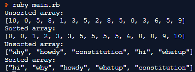

# Bubble Sort (Ruby)

> This Project Implements Bubble Sort On Integer Arrays And Also On String Arrays.

## Built With

- Ruby,
- Rubocop

## Output

## Live Demo

[Live Demo Link](https://repl.it/@SajjadAhmad14/RealisticEarnestCoding#main.rb)

## Authors

👤 **Tadeu Sarro**

- Github: [@githubhandle](https://github.com/tadeuasarro)
- Twitter: [@twitterhandle](https://twitter.com/tadeuasarro)
- Linkedin: [linkedin](https://www.linkedin.com/in/tadeuasarro/)

👤 **Sajjad Ahmad**

- Github: [@githubhandle](https://github.com/SajjadAhmad14)
- Twitter: [@twitterhandle](https://twitter.com/Sajjad_Ahmad14)
- Linkedin: [linkedin](https://www.linkedin.com/in/sajjad-ahmad)

## 🤝 Contributing

Contributions, issues and feature requests are welcome!

Feel free to check the [issues page](https://github.com/tadeuasarro/BubbleSort/issues).

## Show your support

Give a ⭐️ if you like this project!

## Acknowledgments

- Hat tip to anyone whose code was used
- Inspiration
- etc
